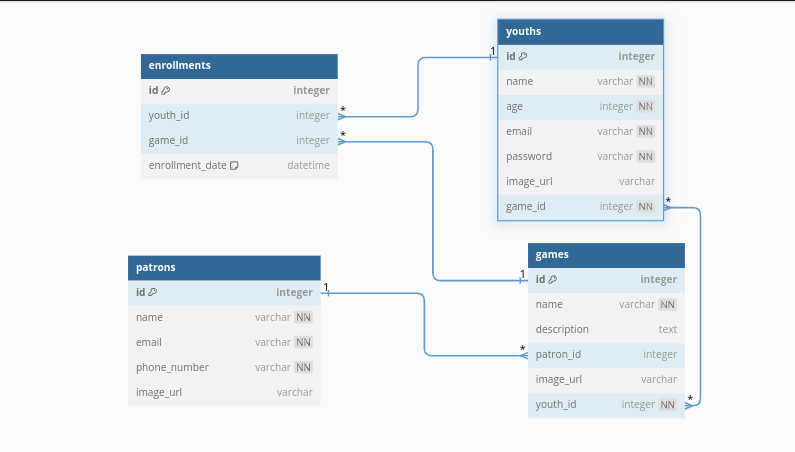

# PetAdopt Management System (AMS)

The PetAdopt Management System (AMS) is a Python-based command-line application designed to streamline the pet adoption process for shelters and potential adopters.

## Features

- **Shelter Management:** Easily manage shelters including adding, updating, deleting, and searching for shelters.
- **Pet Management:** Efficiently manage pets available for adoption. Add, update, delete, and search for pets. Assign pets to shelters.
- **Adoption Request Management:** Track adoption requests from potential adopters. Monitor request status and manage approvals/rejections.
- **Volunteer Management:** Manage volunteers and their roles within the system. Track volunteer activities and availability.
- **User Management:** Administer user accounts with different roles (e.g., shelter staff, administrators, volunteers).

## Getting Started

### Prerequisites

- Python 3.x
- Pip (Python package installer)
- Flask
- Npm

### Installation

1. Clone the repository:

   ```bash
   git clone https://github.com/KiplagaTeddy/Final-Project-PH4

## ERD Diagram
Entity-Relational Diagram (ERD) that shows the relationships between different records from diffrent tables:



## React Web Application (Frontend) 

Once the user lands on the Application , there is a user-frienly Home Page as shown below:

<!--  -->

## Installation


1. Get a free API Key at:
```
https://github.com/KiplagaTeddy/Final-Project-PH4
```
2.Clone the repo
```
git clone https://github.com/KiplagaTeddy/Final-Project-PH4
```
3.And Lastly in the terminal, install relevent files with:
```
 pipenv install
 pipenv install sqlalchemy alembic
 ```

## Setup

After installation, run this command in your terminal to get cli running :

```
python cli.py
```

## Technologies used
1.Python    
2.SqlAlchemy
3.React
4.Flask
5.Tailwind

## Installation Requirements
Git
React
Flask
Npm

## Licenses
MIT License

Copyright (c)  GROUP 8 2024

Permission is hereby granted, free of charge, to any person obtaining a copy
of this software and associated documentation files (the "Software"), to deal
in the Software without restriction, including without limitation the rights
to use, copy, modify, merge, publish, distribute, sublicense, and/or sell
copies of the Software, and to permit persons to whom the Software is
furnished to do so, subject to the following conditions:

The above copyright notice and this permission notice shall be included in all
copies or substantial portions of the Software.

THE SOFTWARE IS PROVIDED "AS IS", WITHOUT WARRANTY OF ANY KIND, EXPRESS OR
IMPLIED, INCLUDING BUT NOT LIMITED TO THE WARRANTIES OF MERCHANTABILITY,
FITNESS FOR A PARTICULAR PURPOSE AND NONINFRINGEMENT. IN NO EVENT SHALL THE
AUTHORS OR COPYRIGHT HOLDERS BE LIABLE FOR ANY CLAIM, DAMAGES OR OTHER
LIABILITY, WHETHER IN AN ACTION OF CONTRACT, TORT OR OTHERWISE, ARISING FROM,
OUT OF OR IN CONNECTION WITH THE SOFTWARE OR THE USE OR OTHER DEALINGS IN THE
SOFTWARE.