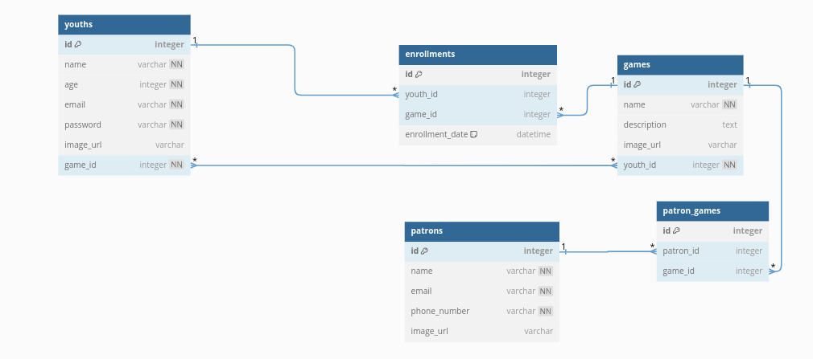

# Vijana Sports System 

### Group Members: Bill Mageni, Teddy Kiplagat, Levis Otieno , Habib Mohamed
#### Date, 2024/07/20


# Introduction

Vijana Sports System  is a full-stack web application designed to streamline youth program management. Using a Flask backend and a React frontend, the platform provides an intuitive experience for managing youth enrollments in various programs. The system facilitates easy communication between patrons, youths, and program administrators, enhancing the overall engagement and effectiveness of youth enrichment initiatives.

## Problem Statement

Many youth programs struggle with inefficient systems for managing enrollments and scheduling activities. This can lead to administrative challenges, missed opportunities for program participation, and communication gaps between program providers and youth participants. Patrons overseeing these programs also face difficulties in organizing and tracking program activities effectively.

## Solution

Vijana Sports System aims to address these challenges by offering a modern, user-friendly platform that centralizes youth program management. The platform enables patrons to create and manage programs, track youth enrollments, and communicate effectively with program participants. For youths, it provides easy access to program details, schedules, and seamless enrollment options, fostering a more engaging and enriching experience.

## User Stories

- **Youth**
  - View a list of available programs to explore different enrichment opportunities.
  - Enroll in various programs offered by different patrons to expand skills and interests.

- **Patron**
  - Create and manage programs, including setting schedules and updating program details.
  - Track youth enrollments in programs to ensure effective program management.

- **Administrator**
  - View comprehensive reports and analytics on program participation and youth engagement.


## ERD Diagram
Entity-Relational Diagram (ERD) that shows the relationships between different records from diffrent tables:


## React Web Application (Frontend) 

Once the user lands on the Application , there is a user-frienly Home Page as shown below:


## Features


### Youth Management
- **View Youths:** Display a list of youths registered in the system with their details.
- **Add Youth:** Allow administrators to add new youths with essential information like name, age, email, and password.
- **Update Youth Information:** Enable updating youth profiles and managing their enrollment status.

### Program Management
- **View Programs:** Provide a comprehensive list of programs offered by various patrons.
<!-- - **Create Programs:** Allow patrons to create new programs with details such as name, description, and schedule. -->
- **Update Program Details:** Enable patrons to modify program information and manage patrons in charge

### Enrollment Management
- **Enroll Youths:** Facilitate youths to enroll in various programs offered by patrons.
<!-- - **Track Enrollments:** Allow patrons to track youth enrollments in their programs and manage enrollment statuses. -->
- **Enrollment History:** Maintain a history of enrollments for each youth and program combination.

### User-Friendly Interfaceb
- **Intuitive Navigation:** Provide easy navigation through a clean and user-friendly interface for all user roles.
- **Search and Filter Options:** Implement search and filter functionalities to find programs based on specific criteria (e.g., name, patron).

### Data Integrity and Validation
- **Form Validation:** Implement forms and validation to ensure accurate data entry and maintain data integrity.
- **Status Updates:** Provide real-time updates to patrons and youths on enrollment statuses and program details.

## Technologies Used

- Python
- Flask
- React
- SQLAlchemy
- Google fonts and CSS

## Response Format
When a user opens the Youth List page, the fetch is:
```jsx
  fetch('/youths')
      .then(response => {
        if (!response.ok) {
          throw new Error(`HTTP error! status: ${response.status}`);
        }
        return response.json();
      })
      .then(data => {
        setYouths(data);
        setFilteredYouths(data);
      })
      .catch(error => console.error('Error fetching youths:', error));
```
For a fetch request for example for a youth with its specific id :
### fetch("/youths/1")
```json 
Example Response:
[
  {
    "password": "1",
    "id": 1,
    "age": 15,
    "email": "youth1@vijanagmail.com",
    "name": "James Smith"
}
]
   ```
For a fetch request for example for a enrollments :
### fetch("/enrollments")
```json 
Example Response:
[
    {
        "game_id": 4,
        "id": 1,
        "enrollment_date": "2024-07-04 02:43:28",
        "youth_id": 1
    },
    {
        "game_id": 5,
        "id": 2,
        "enrollment_date": "2024-06-25 02:43:28",
        "youth_id": 2
    },
]
   ```

For a fetch request for example for a games :
### fetch("/games")
```json 
Example Response:
[
  {
    "image_url": "https://example.com/football.jpg",
    "id": 1,
    "description": "A competitive game involving two teams aiming to score goals by kicking a ball into the opponent's goal.",
    "name": "Football",
    "patron_games": [
      {
        "game_id": 1,
        "id": 7,
        "patron_id": 3
      }
    ]
  },
  {
    "image_url": "https://example.com/rugby.jpg",
    "id": 2,
    "description": "A physically demanding sport where two teams of 15 players aim to carry an oval-shaped ball over the opponent's try line.",
    "name": "Rugby",
    "patron_games": [
      {
        "game_id": 2,
        "id": 3,
        "patron_id": 2
      },
      {
        "game_id": 2,
        "id": 8,
        "patron_id": 4
      }
    ]
  },
]
   ```

## Getting Started

### Prerequisites

- Python 3.x
- Pip (Python package installer)
- Node.js and Npm (for React frontend)

### Installation

1. Clone the repository:

   ```bash
   git clone https://github.com/KiplagaTeddy/Final-Project-PH4

## Installation


1. Get a free API Key at:
```
https://github.com/KiplagaTeddy/Final-Project-PH4
```
2.Clone the repo
```
git clone https://github.com/KiplagaTeddy/Final-Project-PH4
```
3.And Lastly in the terminal, install relevent files with:
```
 npm install --prefix client
 pipenv install
 pipenv install sqlalchemy alembic
 ```

## Setup

After installation, run this command in your terminal to get cli running :

```
python cli.py
```

## Technologies used
1. Python    
2. SqlAlchemy
3. React
4. Flask
5. Google Fonts and CSS

## Installation Requirements
1. Git
2. React
3. Flask
4. Npm

## Licenses
MIT License

Copyright (c)  GROUP 8 2024

Permission is hereby granted, free of charge, to any person obtaining a copy
of this software and associated documentation files (the "Software"), to deal
in the Software without restriction, including without limitation the rights
to use, copy, modify, merge, publish, distribute, sublicense, and/or sell
copies of the Software, and to permit persons to whom the Software is
furnished to do so, subject to the following conditions:

The above copyright notice and this permission notice shall be included in all
copies or substantial portions of the Software.

THE SOFTWARE IS PROVIDED "AS IS", WITHOUT WARRANTY OF ANY KIND, EXPRESS OR
IMPLIED, INCLUDING BUT NOT LIMITED TO THE WARRANTIES OF MERCHANTABILITY,
FITNESS FOR A PARTICULAR PURPOSE AND NONINFRINGEMENT. IN NO EVENT SHALL THE
AUTHORS OR COPYRIGHT HOLDERS BE LIABLE FOR ANY CLAIM, DAMAGES OR OTHER
LIABILITY, WHETHER IN AN ACTION OF CONTRACT, TORT OR OTHERWISE, ARISING FROM,
OUT OF OR IN CONNECTION WITH THE SOFTWARE OR THE USE OR OTHER DEALINGS IN THE
SOFTWARE.